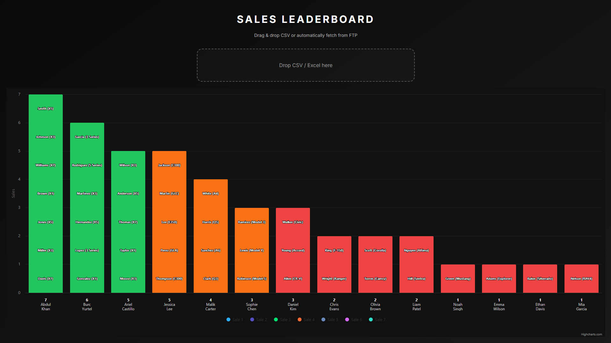

# Sales Leaderboard

A fashionable, interactive sales leaderboard with:

- Stacked blocks per sale
- Top line = number of sales
- Bottom line = salesperson name
- Top 3 / next 3 / remaining coloring
- Tooltips per sale
- Drag & drop CSV/Excel upload
- Automatic FTP CSV fetch
- Clean, responsive design

---

## Project Structure

SalesLeaderboard/
├── server.js
├── package.json
└── public/
    ├── index.html
    ├── styles.css
    └── app.js

---

## Installation

git clone <repository_url>
cd SalesLeaderboard
npm install

---

## Run

npm start

Open:
http://localhost:5000

---

## Features

- Drag & drop CSV → instant update
- FTP auto-fetch every 10 minutes
- Stacked blocks = individual sales
- Top number = total sales per person
- Bottom label = salesperson name
- Ranking colors:
  - Top 3 → Green
  - Next 3 → Orange
  - Rest → Red

---

## FTP Setup

Update in server.js:

host: ftp.example.com  
user: your_username  
password: your_password  
remote file: remote_sales.csv  

---

## CSV Format

salesperson,customer,vehicle  
John,Alice,BMW  
John,Bob,Audi  
Sara,Tom,Tesla  

---

## Dependencies

npm install express basic-ftp csv-parse multer

Frontend uses CDN:
- Highcharts
- XLSX

---

## Screenshot

---

## Notes

- sales.csv is auto-generated → do not commit
- Use drag & drop OR FTP (both supported)
- FTP is optional for automation

---

## License

MIT
